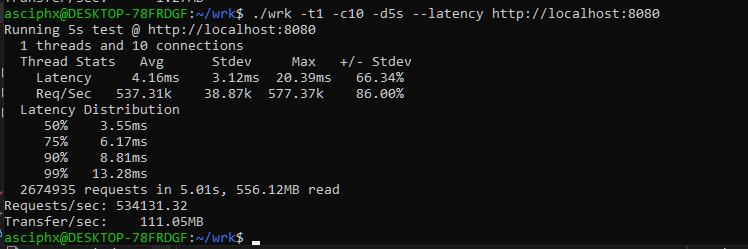
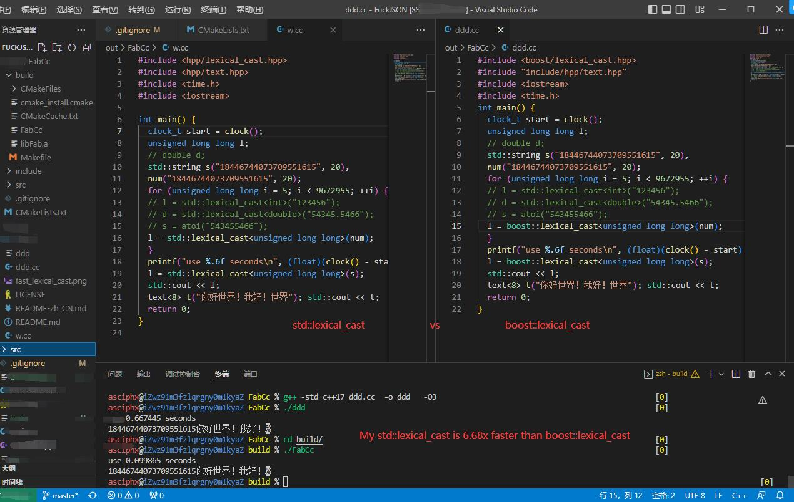

# FabCc
简洁、迅速、实用、活跃、全面。灵感来自于其他c++知名web框架。

## 説明
- 命名空間采用FabCc的大寫駝峰fc來使用。
- 暫時只提供了基於libuv的windows版本的服務端開發，後續打算支持linux，mac。
- 暫時由于buffer需要缓冲，所以得先刷新几次页面预热，才能测试，因此需要进行线程池改造，但会更加复杂。
- 

## fast_lexical_cast
- 模板函数若不是'.hpp'文件则无法在g++上无法内联
- 坏处是牺牲性能来换取编译速度
- 好处是开发速度得到巨幅的提升
- 
