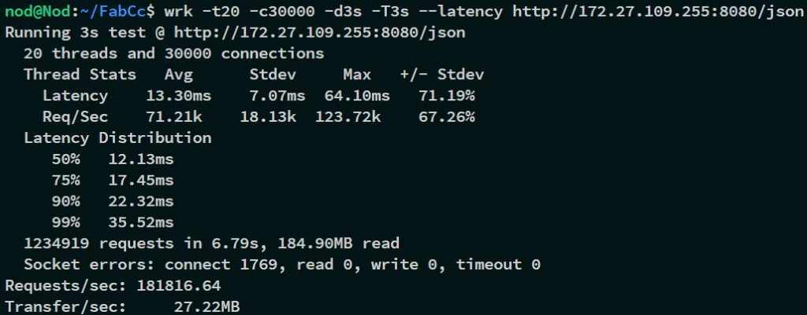

# FabCc(v1.0-beta)
简洁、迅速、实用、活跃、全面。灵感来自于其他c++知名web框架, 堪称c++版的nodejs。

## 特征
- 可以对路由进行增删改查
- 能够使用全局定时器任务，来控制一些事情，比如到期关闭服务器
- 拥有类似nodejs的api，写起来也像js
- 极简的api，无限的可能
- 最快的api例如lexical_cast, 以及EncodeURL, DecodeURL
- 难以置信的编译速度，开发速度同时也得到提升
- 最少的第三方库，均以源文件形式存放项目中
- 全平台支持，（已经测试Linux和Windows）
- 最小化申请与释放内存，对硬盘友好，%0磁盘占用，几乎没有磁盘io

## 仍在开发中
- [x] 路由大括号表达式
- [x] gzip压缩
- [x] body-parser的支持
- [ ] ssl证书
- [ ] websocket
- [ ] udp服务端
- [ ] tcp客户端client

## 説明
- 命名空間采用FabCc的大寫駝峰fc來使用。
- [示例](http://8.129.58.72:8080/)🚀
- 

## 例子
```c++
using namespace fc;
void funk(Req& req, Res& res) {
  res.write("主页路由被std::bind复写！");
};
int main() {
  Timer t; App app; Tcp srv;
  app.sub_api("/", app.serve_file("static"));//服务文件接口
  app["/u/:id(\\d+)"] = [](Req&, Res& res) {
	res.write("！");
  };
  app["/api/\\d/\\w+"] = [](Req& req, Res& res) {
	res.write(req.url);//regex表达式
  };
  app["/api"] = [&app](Req& req, Res& res) {
	res.write(app._print_routes());//返回路由列表
  };
  app.post("/api") = [](Req& req, Res& res) {
	BP bp(req, 4096);
	for (auto p : bp.params) {
	  res.write(p.key + ": " + (!p.size ? p.value : p.filename) + ", ");
	}
  };
  app["/del"] = [&app](Req&, Res& res) {
	app.get() = nullptr;
	res.write("主页的路由被删除！！");//或者像下面std::bind的方式把void方法绑定都行
  };
  app["/timer"] = [&](Req&, Res& res) {
	t.setTimeout([&srv] {
	  printf("该路由已闲置1分钟，服务器即将自动关闭！！");
	  srv.exit();
	}, 60000);
	res.write("计时器倒计时启动！");
	app.get() = std::bind(funk, std::placeholders::_1, std::placeholders::_2);
  };
  //启动服务器
  srv.router(app).timeout(4000).setTcpNoDelay(true).Start("0.0.0.0", 8080);
  return 0;
}
```

### 建筑（测试、示例）
建议使用CMake进行源代码外构建。
```
mkdir build
cd build
cmake ..
cmake --build ./ --config Release
```
