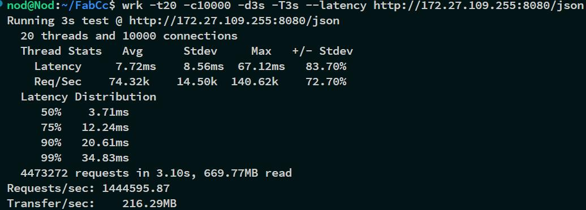

# FabCc(v1.0-beta)
Concise, fast, practical, reactive, functional. Inspired by other well-known C++ web frameworks, which can be called the C++ version of nodejs.

## Features
- Can add, delete, modify and query the route
- Use the global timer task to control some things, such as shutting down the server when it expires
- With an API similar to nodejs, it also looks like JS
- Minimalist API, infinite possibilities
- Fastest API, such as lexical_cast, EncodeURL, DecodeURL
- Incredible compilation speed and development speed are also improved
- The fewest third-party libraries, are stored in the project in the form of source files
- Cross platform support, (Linux and windows have been tested)

## Still under development
- [x] Processing of routing brace
- [x] Gzip compression
- [x] Body parser
- [ ] SSL certificate support
- [ ] WebSocket
- [ ] UDP server
- [ ] TCP client

## Description
- The namespace uses the uppercase hump fc of FabCc.
- [Demo site](http://8.129.58.72:8080/)🚀
- 

## example
```c++
using namespace fc;
void funk(Req& req, Res& res) {
  res.write("Homepage route is replicated by std::bind！");
};
int main() {
  Timer t; App app; Tcp srv;
  app.sub_api("/", app.serve_file("static"));//Service file interface
  app["/u/:id(\\d+)"] = [](Req&, Res& res) {
	res.write("！");
  };
  app["/api/\\d/\\w+"] = [](Req& req, Res& res) {
	res.write(req.url);//routing regex 
  };
  app["/api"] = [&app](Req& req, Res& res) {
	res.write(app._print_routes());//Return to routing list
  };
  app.post("/api") = [](Req& req, Res& res) {
	BP bp(req, 4096);
	for (auto p : bp.params) {
	  res.write(p.key + ": " + (!p.size ? p.value : p.filename) + ", ");
	}
  };
  app["/del"] = [&app](Req&, Res& res) {
	app.get() = nullptr;
	res.write("The routing of the home page is delete！！");//Or bind the void method in the following std::bind way
  };
  app["/timer"] = [&](Req&, Res& res) {
	t.setTimeout([&srv] {
	  printf("The route has been idle for 1 minute, and the server will shut down automatically！！");
	  srv.exit();
	}, 60000);
	res.write("Timer countdown start！");
	app.get() = std::bind(funk, std::placeholders::_1, std::placeholders::_2);
  };
  //Start the server
  srv.router(app).timeout(4000).setTcpNoDelay(true).Start("127.0.0.1", 8080);
  return 0;
}
```

### Building (Tests, Examples)
Out-of-source build with CMake is recommended.
```
mkdir build
cd build
cmake ..
cmake --build ./ --config Release
```
